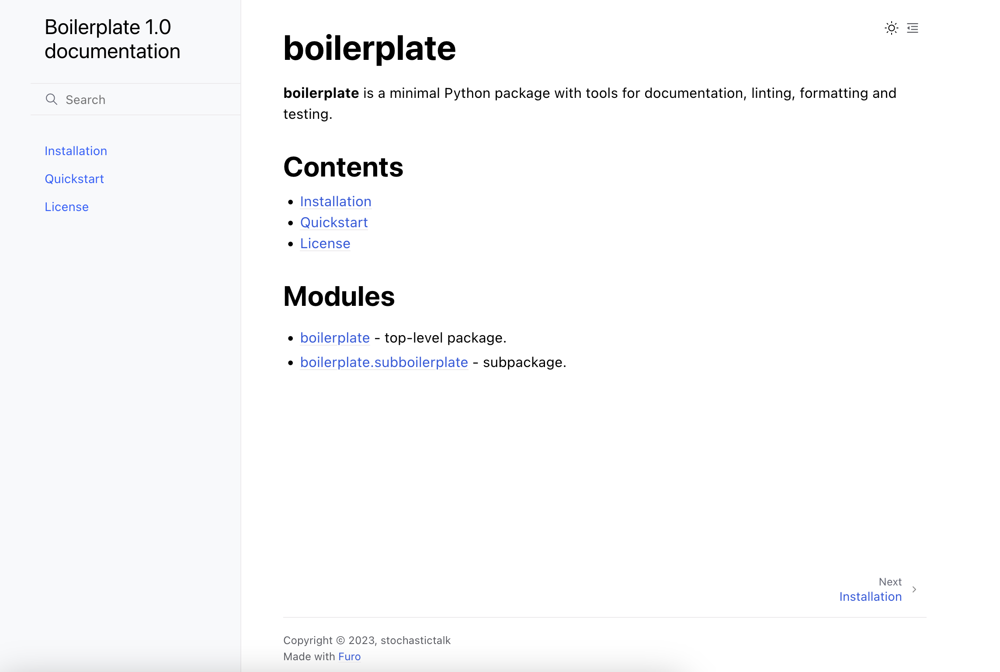

# 🫖 alignment_forum_qa_bot

  

A minimal Python package with tools for documentation, linting, formatting and testing.

- 📜 Docs: `sphinx`
- 🧰 Linting: `ruff`
- ⚫ Autoformatting: `black`
- 🧪 Testing: `pytest`


## Quickstart

First, prove to yourself the package installs correctly, its tests run, and its documentation compiles.

If you're using Docker, launch a Python container and connect to its shell
```
docker run -it -p 3527:3527 -v ${PWD}:/package python:3.9 /bin/bash
```

Install the development version of the package in editable mode to the environment with
```
pip install -e '.[develop]'
```
The package's configuration is in `pyproject.toml` (summary [here](https://setuptools.pypa.io/en/latest/userguide/pyproject_config.html)). The directory structure follows the src layout ([details](https://setuptools.pypa.io/en/latest/userguide/package_discovery.html)). Its version is managed using `setuptools_scm`, meaning version numbers are automatically extracted from git tags: you can read about the versioning logic [here](https://pypi.org/project/setuptools-scm/).

Install the precommit hooks:
```
pre-commit install
```
You can edit the config of these in `.pre-commit-config.yaml`.

Check the tests run:
```
pytest
```
Compile the documentation:
```
cd docs
make html
```
Host the resulting doc HTMLs using Python's webserver:
```
python -m http.server 3527 -d ../build/sphinx/html
``` 
Open a web browser on the host and go to `localhost:3527`. You should see the docs.

To start developing in the context of your own git repo, delete the `.git` directory and initialize a new one with `git init`. 




Finally, to create a wheel and sdist for your package:
```
python -m build --wheel
```
They will be output to a directory `dist/`.

Enjoy! 🫖

Shields courtesy of [shields.io](https://shields.io/).
