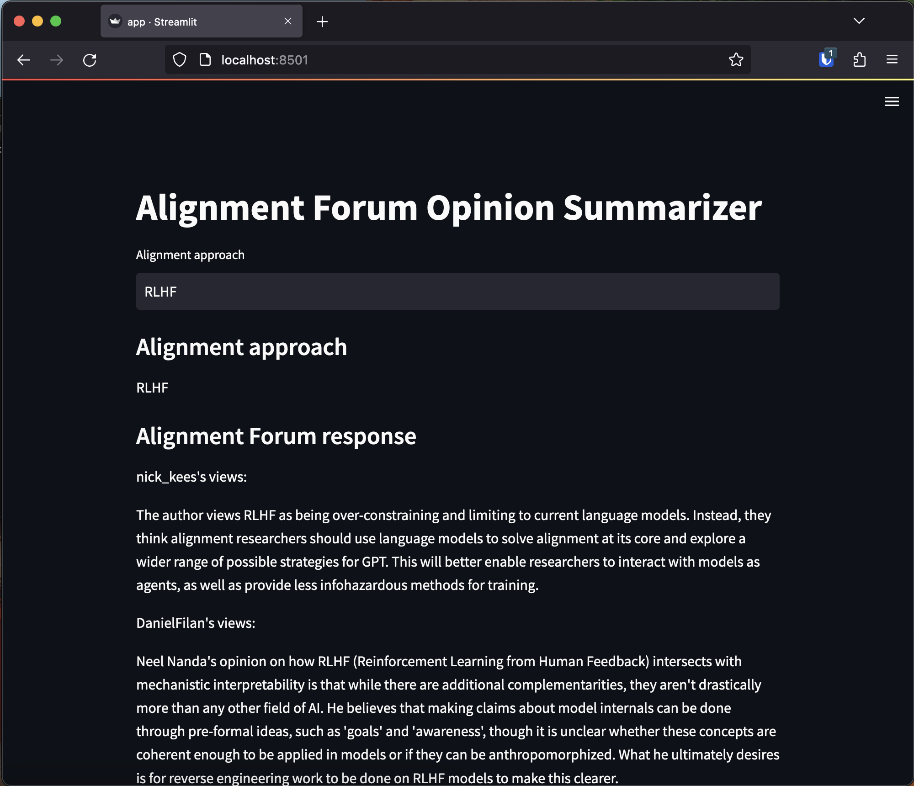
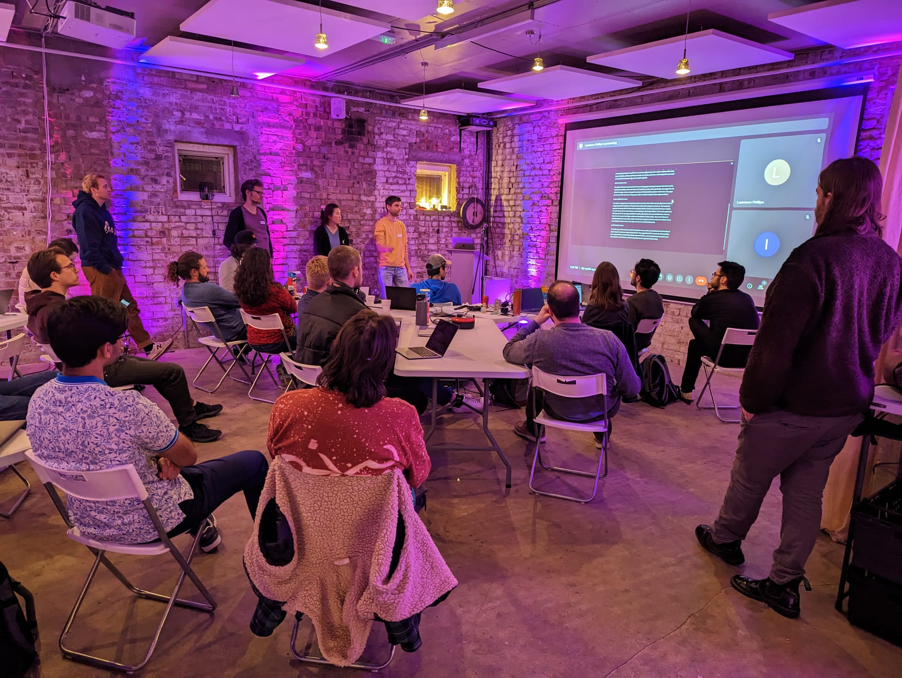

# 📏💬 `alignment_forum_qa_bot`


`alignment_forum_qa_bot` is a Python package that retrieves and summarizes [Alignment Forum](https://www.alignmentforum.org/) posts based on a keyword search. We built it over about 8 hours at the first EA London hackathon on 11th February 2023.

Here's a screenshot of the Streamlit prototype:



And here's us blowing some tiny minds presenting it:



The ambition is that the Metaculus team will eventually integrate a chatbot into the Alignment Forum. If you're interested in contributing to or learning more about this, get in touch with Lawrence Phillips, who's AI Forecasting Lead at Metaculus.

## Installation

You can install the package directly from this repo with
```
pip install git+https://github.com/stochastictalk/alignment-forum-qa-bot
```
🚨 You'll need to create a `.env` file in your working directory that defines variables `DATA_DIR` and `OPENAI_API_KEY` - see the quickstart for details 🚨

## Quickstart

The bot is implemented through the `QABot` class. It has a [retriever-reader architecture](https://www.pinecone.io/learn/retriever-models/), meaning that:
- When `QABot` is created, all Alignment Forum posts are processed and written into a database-like data structure.
- Each time `QABot.query()` is called, relevant documents are retrieved (e.g. via binary keyword frequency) then 'read' (i.e. summarized) by OpenAI's Completion API. The summaries are gathered into a string, which is then returned.

To use the bot you will need an [OpenAI API key](https://openai.com/api/).

This example illustrates how to initialize the bot and send a single query to it.

```
from ai_forum_qa_bot import QABot
from dotenv import dotenv_values

# To use the bot, you need to create a .env file that looks like:
#     DATA_DIR="data/"
#     OPENAI_API_KEY="sk-yourOpenAIAPIkey"
config = dotenv_values(".env")

# Initialize the bot (downloads and preprocesses all Alignment Forum posts).
bot = QABot(openai_api_key=config["OPENAI_API_KEY"])

# Select keyword for post retrieval.
keyword = "cyborgs"

# Ask the bot to generate summaries.
response = bot.query(query_text=keyword, method="summarize-by-author")
```

There are two ways the bot could be improved:
* At the moment, the default retriever (see `retriever.py`) used in `QABot` is a binary keyword frequency retriever. It's likely that you'll get better performance by using a slightly more sophisticated retriever, e.g. there is the beginnings of a tf-idf retriver in `TFIDFRetriever`, or embedding-based retrieval with a question-answer embedding model.
* If you want to alter the way in which the query text and retrieved posts are synthesised to create a response (i.e. the reader), add a method to `QABot`'s class definition that receives `query_text:str` and `posts:List[Dict]` and returns a `str`, then include an entry for it in the `get_reponse`'s `case_switch` dictionary. You will then be able to direct inputs to it via the `method` parameter of `QABot.query()`.

## Developer Quickstart

First thing to do is to create a virtual environment. Install `virtualenv` using
```
pip install virtualenv
```
Then create a virtual environment with
```
python -m virtualenv venv
```
This creates a virtual environment called "venv". Activate it via
```
source venv/bin/activate
```
Great! Now you're ready to install the package.

Install the development version of the package in editable mode to the environment with
```
pip install -e '.[develop]'
```
The package's configuration is in `pyproject.toml` (summary [here](https://setuptools.pypa.io/en/latest/userguide/pyproject_config.html)). If you need a dependency, add it to this file.

Test the package install by opening Python and running `import ai_forum_qa_bot`.

The precommit hooks provide linting and autoformatting. Install them by running
```
pre-commit install
```
These will run automatically each time you commit.

To run the streamlit app, execute
```
streamlit run app.py
```
Then open your browser and go to whichever port the server's listening on.
